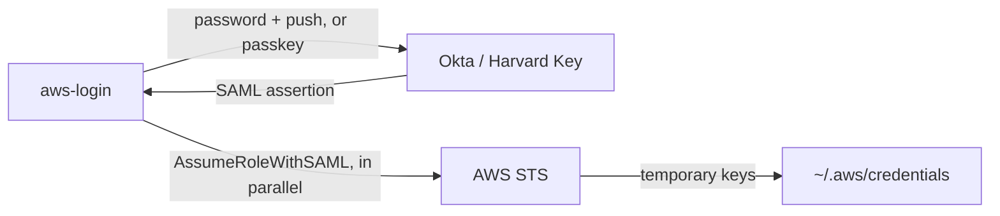

# aws-login

[](LICENSE)

A command-line tool that signs in to Harvard Key (Okta SAML) once and writes temporary AWS credentials for every AWS
account and role you use, so `aws --profile <name>` just works.

## Table of Contents

- [Overview](#overview)
- [Quick Install](#quick-install)
- [Features](#features)
- [Usage](#usage)
- [Documentation](#documentation)
- [How It Works](#how-it-works)
- [Contributing](#contributing)
- [Credits](#credits)
- [License](#license)

## Overview

Getting CLI credentials for several AWS accounts behind Harvard Key normally means a browser, an MFA push, and
copy-pasting keys per account. `aws-login` does it in one step: it authenticates with Okta (password + Okta Verify
push, or a passkey in the browser), exchanges the SAML assertion with AWS STS for every role in your config, and writes
a named profile for each one to `~/.aws/credentials`.

This is a hard fork of HUIT's `aws-login-saml-cli`, maintained independently. See [Credits](#credits).

## Quick Install

```bash
git clone https://github.com/ventz/aws-login.git
cd aws-login
go build -o aws-login .
sudo mv aws-login /usr/local/bin/
aws-login --help
```

Requires Go 1.26+. For prebuilt binaries, macOS Gatekeeper warnings, and upgrading from upstream, see
[Installation](docs/install.md).

## Features

- **One login, every account**: a single authentication writes credentials for all profiles in your `profile_map`
- **Parallel STS**: role exchanges run concurrently, so login time stays flat as you add accounts
- **Longest valid sessions**: asks for 8 hours and steps down automatically for roles capped lower (4h, 1h)
- **Passkey login**: optional browser flow with Harvard Key passkeys, including fully unattended logins
  ([Passkey Login](docs/passkey.md))
- **OS keyring**: stores your password (or passkey) in Keychain / Secret Service / Windows Credential Manager
- **Role switching and chaining**: change `[default]` without re-authenticating, or assume extra IAM roles
- **Shell completion**: Bash and Zsh, including profile names

## Usage

First, find the roles you are entitled to and give them short names in `~/.config/huit_aws/config.json`:

```bash
aws-login list
```

```json
{
    "username": "user@harvard.edu",
    "profile_map": {
        "arn:aws:iam::111111111111:role/admints-dev-standard-saml-poweruser-iam-role@us-east-1": "admints-dev",
        "arn:aws:iam::222222222222:role/admints-prod-standard-saml-poweruser-iam-role@us-east-1": "admints-prod"
    }
}
```

Then log in to all of them at once:

```bash
aws-login login                 # every saved profile; [default] unchanged
aws-login login admints-dev     # every saved profile, and admints-dev becomes [default]
aws --profile admints-prod sts get-caller-identity
```

| Command                 | What it does                                                           |
|-------------------------|------------------------------------------------------------------------|
| `login [profile]`       | Log in to all saved profiles; optionally make one `[default]`          |
| `list`                  | List the role ARNs you are entitled to                                 |
| `list-role-map`         | Show your saved profile names                                          |
| `switch <profile>`      | Make a logged-in profile `[default]` without re-authenticating         |
| `assume <role>`         | Assume an extra IAM role from `assumable_roles`                        |
| `configure_keyring`     | Store your password in the OS keyring                                  |
| `configure_passkey`     | Enroll a passkey for unattended `--passkey` logins                     |

Single-letter flags use one dash (`-v`, `-t 3600`); long flags use two (`--passkey`, `--show-config`). See the
[Usage Reference](docs/usage.md) for every command and flag.

## Documentation

| Page                                     | Contents                                                          |
|------------------------------------------|-------------------------------------------------------------------|
| [Installation](docs/install.md)          | Building, prebuilt binaries, macOS notes, upgrading from upstream |
| [Usage Reference](docs/usage.md)         | All commands, flags, and shell completion                         |
| [Configuration](docs/configuration.md)   | Config file location, every option, session durations             |
| [Passkey Login](docs/passkey.md)         | Browser login modes, passkey enrollment, troubleshooting          |
| [Architecture](docs/architecture.md)     | How the Okta and STS flows work, code layout, design decisions    |
| [Changelog](CHANGELOG.md)                | Release history and breaking changes                              |
| [Security](SECURITY.md)                  | Reporting vulnerabilities, where sensitive data is stored         |

## How It Works



## Contributing

Issues and pull requests are welcome. See [CONTRIBUTING.md](CONTRIBUTING.md) for development setup, testing, and
conventions.

## Credits

- **Andrew MacKenzie**: the original Go port.
- **Ventz Petkov**: reverse engineering of Harvard Key's Duo authentication, the port to Okta / Harvard Key, passkey
  login, and ongoing maintenance.

## License

[MIT](LICENSE) © Ventz Petkov
