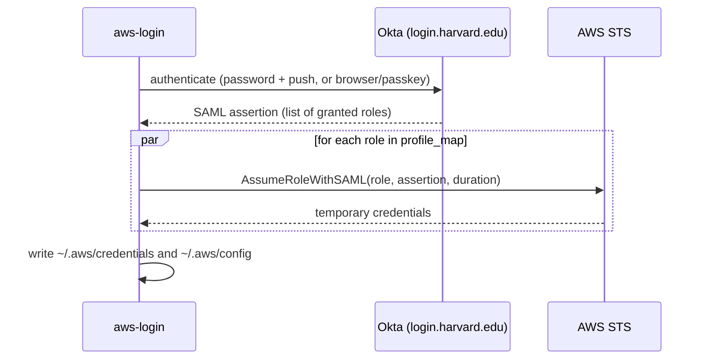

# Architecture

How `aws-login` turns one Harvard Key sign-in into credentials for many AWS accounts.

## Table of Contents

- [Overview](#overview)
- [Code Layout](#code-layout)
- [Password Flow](#password-flow)
- [Passkey Flow](#passkey-flow)
- [STS Exchange](#sts-exchange)
- [Design Decisions](#design-decisions)

## Overview

Every command that needs AWS access follows the same shape: get a **SAML assertion** from Okta, read the roles it
grants, and exchange it with **AWS STS** (`AssumeRoleWithSAML`) for temporary keys. The two login methods differ only
in how the assertion is obtained.

## Code Layout

| Path                         | Responsibility                                                                  |
|------------------------------|---------------------------------------------------------------------------------|
| `main.go`                    | Flag parsing, dash-convention check, help text, command dispatch                |
| `commands.go`                | `login`, `list`, `switch`, `assume`, keyring and passkey commands, completion   |
| `okta/okta.go`               | Okta Identity Engine (IDX) password + Okta Verify push flow                     |
| `okta/passkey.go`            | Chrome-driven login and SAML capture for `--passkey`                            |
| `okta/passkey_register.go`   | One-time passkey enrollment (`configure_passkey`)                               |
| `aws/aws.go`                 | SAML parsing, parallel STS exchange, session duration resolution and fallback   |
| `aws/awsconfig.go`           | Reading and writing `~/.aws/credentials` and `~/.aws/config`                    |
| `config/`                    | Flag struct, config file location, loading, and legacy migration                |
| `credential/`                | OS keyring storage for the password and the passkey credential                  |

## Password Flow

`okta/okta.go` walks Okta's IDX API as a state machine. Each response carries a `stateHandle` that must be passed to
the next call; a response without one means the session is over, and the flow stops with Okta's error message.

1. **Introspect** the Okta AWS app to start a session.
2. **Identify** with the username.
3. **Challenge / answer** with the password (from the keyring or a prompt).
4. **Challenge** Okta Verify push, then **poll** every 2 seconds for up to 2 minutes while you approve.
5. **Keep me signed in**, which returns the redirect to the SAML endpoint.
6. **Fetch the SAML assertion** from that redirect.

All HTTP calls share a client with a 30-second timeout, so a hung endpoint fails instead of blocking.

## Passkey Flow

`okta/passkey.go` launches Chrome through the DevTools Protocol with a dedicated profile and intercepts the browser's
POST of the SAML assertion to `https://signin.aws.amazon.com/saml`, cancelling it so the AWS console never loads. It
chooses between three modes on every run (stored passkey, recent session cookie, interactive window); see
[Passkey Login](passkey.md#login-modes).

Two constraints shape the code:

- The virtual authenticator must be installed **before** the page loads so Okta's WebAuthn request reaches it, but
  during enrollment it must be installed only **after** you have signed in, or it would intercept your real Touch ID.
- Okta's sign-in page is a React app, so the username is filled in with React's native value setter rather than
  simulated typing, which would otherwise double the text.

## STS Exchange

`aws.GetAwsCredentials` filters the assertion's roles down to those in `profile_map`, then calls
`AssumeRoleWithSAML` for each with up to 10 requests in flight at once. Login time therefore stays roughly constant
as you add accounts.

The requested duration comes from `-t`, then `role_timeout_secs`, then `default_timeout_secs`, then 8 hours. A
role's IAM `MaxSessionDuration` is not visible in advance, so when STS rejects a duration as too long,
`assumeRoleWithFallback` retries at the next lower step (12h, 8h, 4h, 1h). Other errors are not retried: that profile
is reported as not saved and the rest continue.

## Design Decisions

- **Only mapped roles are exchanged.** Credentials for unmapped roles were never written anywhere, so requesting
  them only added latency.
- **`[default]` changes only on request.** Logging in to everything should not silently change which account plain
  `aws` commands hit.
- **One config path on every OS.** `~/.config/huit_aws` keeps the config next to the passkey Chrome profile and makes
  the location easy to document.
- **Argument errors come before authentication.** Every Okta round trip can mean an MFA push, so anything that can be
  validated locally is.
