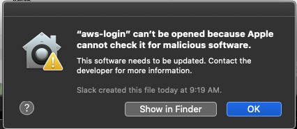

# Installation

## Table of Contents

- [Build from Source](#build-from-source)
- [Prebuilt Binaries](#prebuilt-binaries)
- [Requirements](#requirements)
- [Upgrading from Upstream](#upgrading-from-upstream)

## Build from Source

Requires Go 1.26 or newer.

```bash
git clone https://github.com/ventz/aws-login.git
cd aws-login
go build -o aws-login .
sudo mv aws-login /usr/local/bin/
```

Any directory on your `PATH` works in place of `/usr/local/bin`. If you build from a copy that is not a Git checkout,
add `-buildvcs=false` to the `go build` command.

## Prebuilt Binaries

Tagged releases (`v*`) are built by GoReleaser for Linux, macOS, and Windows on amd64 and arm64. Download the archive
for your platform from the [releases page](https://github.com/ventz/aws-login/releases), extract it, and put the
`aws-login` executable on your `PATH`.

### macOS: "cannot verify the developer"

Binaries downloaded through a browser are quarantined by Gatekeeper:



Either right-click the file in Finder, choose **Open**, and confirm, or remove the quarantine attribute:

```bash
xattr -d com.apple.quarantine /usr/local/bin/aws-login
```

Building from source avoids this entirely.

## Requirements

- **Password login** (the default): a Harvard Key account with **Okta Verify push** enrolled. DUO is not supported.
  See the [Okta Quick Start](https://harvard.service-now.com/ithelp?id=kb_article&sys_id=93e0b60493102a10bf14bbcd1dba10c4).
- **Passkey login** (`--passkey`): Google Chrome. See [Passkey Login](passkey.md).
- **Shell completion**: `jq`, which the completion scripts use to read your profile names.

## Upgrading from Upstream

Coming from HUIT's `aws-login-saml-cli`, note these changes:

1. **Config file location.** The config now lives at `~/.config/huit_aws/config.json` on every OS. If only the old
   file exists (for example `~/Library/Application Support/huit_aws/config.json` on macOS), it is copied to the new
   location on the first run and the old file is left in place. Keyring entries are unchanged.
2. **`login` never prompts.** `aws-login login` writes every profile in `profile_map` and leaves `[default]` alone.
   Pass a profile name to also set `[default]`. A `profile_map` is now required; run `aws-login list` to find your
   role ARNs. `login_all` still works and is the same as `login`.
3. **Flag spelling.** Long flags take two dashes (`--passkey`, `--headed`, `--show-config`, `--keyring=false`);
   single-letter flags take one (`-v`, `-t`, `-d`, `-h`). The old `-passkey` spelling is rejected with a hint.
4. **Session length.** The built-in default is now 8 hours, with automatic step-down for roles capped lower.
   See [Configuration](configuration.md#session-duration).

Upgrading from 1.x also means: the `login -a` switch is gone (logging in to all profiles is the default), and Okta
Verify push replaced DUO.
